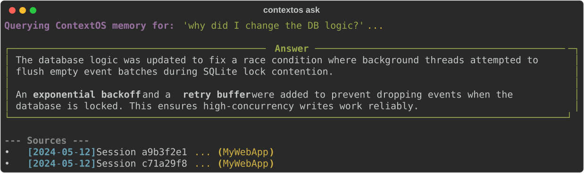
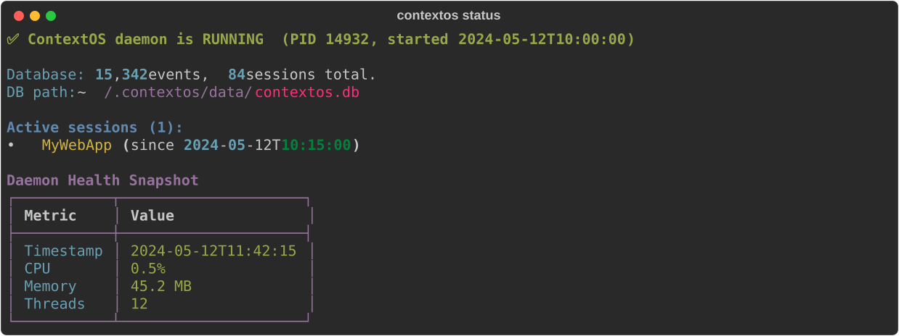
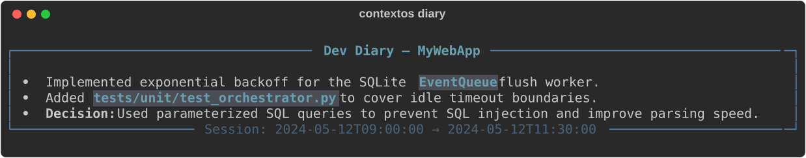
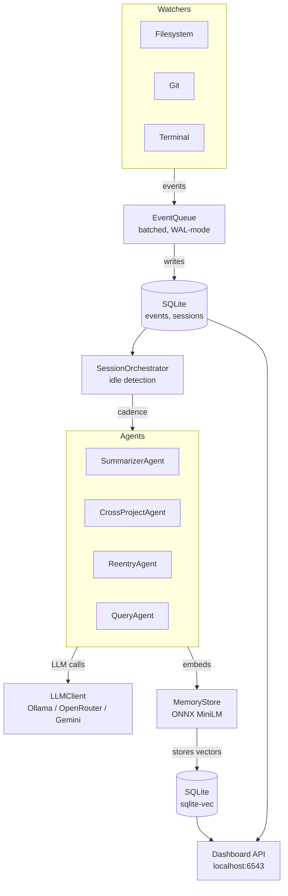

<p align="center">
  <h1 align="center">🧠 ContextOS</h1>
  <p align="center">
    <strong>A local, near-zero-footprint developer memory daemon.</strong><br>
    It runs quietly in the background while you code, records what you touch, summarizes your sessions, and lets you ask your own work history questions in plain English.
  </p>
  <p align="center">
    <a href="https://pypi.org/project/contextos-daemon/"></a>
    <a href="https://python.org"></a>
  </p>
</p>

ContextOS does not build a productivity dashboard, does not score you, and does not phone home. The only goal is recall.

<p align="center">
  
</p>

---

## ⚡ Why this exists

Development context is scattered across file diffs, commit messages, terminal scrollback, and half-remembered decisions. Most of it evaporates the moment you close your laptop. ContextOS turns that activity into a searchable memory layer so you can:

- **Return to a project after a break** and know exactly where you left off.
- **Reconstruct *why* a file or feature changed**, not just *that* it changed.
- **Get an automatically written Dev Diary** for every session, with zero manual effort.
- **Ask questions about past work** instead of archaeologizing through `git log`.

## ✨ How it's different

Most background dev-activity tools (time trackers, usage analytics, AI-coding-session loggers) answer *"what did I do and for how long."* ContextOS answers *"why did I do it,"* on demand, in natural language, grounded in your own history — not a leaderboard, not a report you'll never read.

---

## 🚀 Installation

Requires Python 3.11+.

```bash
pip install contextos-daemon
```

This installs the `contextos` CLI. All data and configuration live outside your projects, in `~/.contextos/` — the daemon never writes into a directory it's watching.

### Bring your own model

ContextOS supports three LLM backends. Configure one (or none) in `~/.contextos/.env`:

#### OpenRouter (cloud, many models)
```bash
OPENROUTER_API_KEY=your_key_here
OPENROUTER_MODEL=openai/gpt-4o-mini   # optional override
```

#### Gemini (cloud, Google)
```bash
GEMINI_API_KEY=your_key_here
GEMINI_MODEL=gemini-2.0-flash          # optional override
```

#### Ollama (fully local, no API key needed)
```bash
LLM_PROVIDER=ollama
OLLAMA_BASE_URL=http://localhost:11434  # default
OLLAMA_MODEL=llama3.2                  # base model for all agents
OLLAMA_SUMMARIZER_MODEL=               # override per-agent (optional)
OLLAMA_QUERY_MODEL=
OLLAMA_REENTRY_MODEL=
```

Provider selection order when `LLM_PROVIDER=auto` (default):
1. OpenRouter (if key present)
2. Gemini (if key present, re-entry agent only)
3. Disabled (raw summaries returned instead of synthesized answers)

*No key and no Ollama configured?* ContextOS still records and semantically indexes everything — `contextos ask` returns the raw retrieved summaries instead of an LLM-synthesized answer.

---

## 💻 Usage

Start the daemon in any project directory:

```bash
$ contextos start
```

Keep working normally. ContextOS watches your filesystem, git activity, and terminal output in the background, ignoring noise like `node_modules`, `.git`, and build artifacts. When you go idle, it closes the session and writes a Dev Diary automatically.

### Interactive Menu

Simply type `contextos` with no arguments to open the **interactive TUI menu**. From here, you can seamlessly navigate using your arrow keys to ask questions, view diaries, manage the daemon, or export context.

### Local Web Dashboard

```bash
$ contextos dashboard
```

Opens `http://127.0.0.1:6543` in your browser — a rich local dashboard that shows live sessions, events, health metrics, and AI-generated summaries. The dashboard API starts automatically with the daemon (disable with `DASHBOARD_ENABLED=false` in `.env`).

### Context Export for LLMs

Hit a context window limit in ChatGPT or Claude? Select **"Export full context for AI (Clipboard)"** from the interactive menu (or run `contextos export`). ContextOS will instantly compile your recent Dev Diaries and active session events into a neat Markdown document and copy it directly to your clipboard, ready to paste into any LLM!

<p align="center">
  
</p>

### VS Code Auto-Start Integration

Tired of typing `contextos start` every time you open a project? ContextOS can automatically start watching your project the moment you open it in VS Code.

Run `contextos init` inside any project folder (or select **"⚡ Auto-Start in VS Code"** from the interactive menu). This configures a lightweight VS Code task (`.vscode/tasks.json`) that triggers `contextos start` in the background when the folder opens. Since ContextOS goes to sleep on its own when you stop typing, you never have to think about it again!

```bash
$ contextos                     # Opens the interactive menu
$ contextos ask "what was I debugging this morning?"
$ contextos diary                 # latest Dev Diary
$ contextos export                # copy LLM context to clipboard
$ contextos dashboard             # open local web dashboard
$ contextos init                  # auto-start daemon in VS Code
$ contextos backfill              # re-index existing history into the vector store
$ contextos stop
```

<p align="center">
  
</p>

---

## 🏗️ Architecture



**Design principles:**
- **Local-first.** SQLite + sqlite-vec on disk, no external service required to record or search.
- **Bring your own key.** LLM calls only happen for summarization and `ask` — and only if you've configured one. Ollama lets you go fully air-gapped.
- **Resilient by default.** Each watcher runs independently and is supervised; a crashed watcher restarts without taking the daemon down. SQLite writes retry through lock contention instead of dropping events.
- **Path-aware.** Every watched directory is registered against its absolute path, so generated artifacts (Dev Diaries, similarity notices, re-entry briefs) always land in the actual project, not a guessed working directory.

---

## 🏎️ Performance & Footprint

| Metric | Value |
|---|---|
| Idle CPU | `0.5%` |
| Idle RAM | `113.8 MB` |
| Disk growth | `15.0 KB / 1000 events` |

Embeddings run through a local ONNX MiniLM model and are stored in sqlite-vec — no PyTorch dependency, loaded on demand rather than held in memory permanently.

---

## 🛠️ Testing

```bash
pip install -e ".[dev]"
pytest tests/ -v
```

The suite covers event-queue batching and retry behavior, session idle-timeout state transitions, filesystem ignore-pattern matching, cross-project similarity thresholds (including false-positive checks), re-entry stale-gate logic, query-agent retrieval accuracy against seeded fixtures, LLM provider selection and graceful failure paths (including simulated Ollama `ConnectionRefused` and HTTP 503), and all 7 dashboard API endpoints including the DB-unavailable degradation case.

---

## 🗺️ Roadmap

- [x] Filesystem, git, and terminal watchers with automatic supervision and restart
- [x] Session lifecycle management with idle detection
- [x] LLM-powered mini-summaries and Dev Diaries
- [x] Semantic memory via sqlite-vec (`contextos ask`)
- [x] Cross-project similarity detection
- [x] Re-entry briefs after a break
- [x] Interactive TUI menu & automated API key prompting
- [x] Clipboard context export for LLM handoffs
- [x] Local Ollama support (fully air-gapped operation)
- [x] Local web dashboard (`localhost:6543`) for browsing history without the CLI
- [ ] Additional watcher sources (clipboard is present but off by default; browser tab history under consideration)

---

## 🤝 Contributing

Issues and PRs welcome. Please run `pytest tests/ -v` before submitting — CI runs the full suite on Python 3.11 and 3.12.
