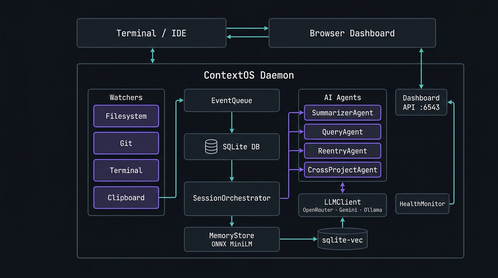

<div align="center">

<br />


<br /><br />

# ContextOS

**A local, always-on developer memory daemon.**

Runs silently in the background. Watches your filesystem, git, and terminal.  
Writes session summaries automatically. Answers questions about your own work in plain English.

[Installation](#installation) · [Quick Start](#quick-start) · [Commands](#commands) · [Configuration](#configuration) · [Architecture](#architecture) · [Contributing](#contributing)

</div>

---

## Overview

ContextOS is a background daemon that records your coding activity and turns it into a queryable memory layer. It is not a time tracker, a productivity score, or an analytics platform. The only goal is **recall**.

- **Zero friction.** `pip install contextos-daemon` → `contextos` → done. No config files to write, no project setup, no manual daemon management.
- **Fully local.** All data lives in `~/.contextos/`. Nothing leaves your machine unless you configure an LLM API key.
- **IDE-agnostic.** Works independently of any editor. Registers as a startup task on Windows so the daemon runs from login.
- **LLM-optional.** Works without any API key. Add one to unlock AI-written summaries and natural language queries.

---

## Installation

```bash
pip install contextos-daemon
```

**Requirements:** Python 3.11 or later.

---

## Quick Start

```bash
cd your-project
contextos
```

On first run, a one-time setup prompt asks for an optional LLM API key. After that, the daemon starts automatically every time you open ContextOS — no `start`/`stop` commands needed.

```
   ______            __             __  ____  _____
  / ____/___  ____  / /____  _  ___/ /_/ __ \/ ___/
 / /   / __ \/ __ \/ __/ _ \| |/_/ __/ / / /\__ \
/ /___/ /_/ / / / / /_/  __/>  </ /_/ /_/ /___/ /
\____/\____/_/ /_/\__/\___/_/|_|\__/\____//____/

  Project: my-project  ·  ● Watching  ·  http://127.0.0.1:6543

? What do you want to do?
❯   💬  Chat
    🌐  Open Dashboard
    📖  Dev Diary
    📋  Copy Context for AI
    ─────────────────────────
    Exit
```

The menu persists after each action. `Ctrl+C` or **Exit** to quit.

---

## Commands

### Interactive menu

```bash
contextos                               # open the persistent TUI menu
```

### Direct commands

```bash
contextos ask "why did I change auth?"  # query memory in natural language
contextos diary                         # read the last session Dev Diary
contextos dashboard                     # open the web dashboard (localhost:6543)
contextos copy                          # copy project context to clipboard for AI agents
contextos status                        # show daemon health and active sessions
```

### Power-user commands

```bash
contextos start                         # manually start / refresh the daemon
contextos stop                          # stop the daemon
contextos forget                        # remove this project from memory
contextos log [--limit N]               # show raw event log
contextos export                        # export full context as Markdown
contextos backfill                      # re-index history into the vector store
```

---

## Web Dashboard

The dashboard starts automatically with the daemon. Open it at `http://127.0.0.1:6543` or via `contextos dashboard`.

| Tab | Contents |
|-----|----------|
| **Overview** | Event totals, session counts, recent sessions at a glance |
| **Sessions** | Full session history with status and AI-generated summaries |
| **Live Events** | Raw filesystem, git, and terminal events with expandable payloads |
| **Summaries** | All mini-summaries and final Dev Diaries |
| **Projects** | Tracked project list — **Stop Tracking** button to remove any project |
| **Health** | Live CPU, RAM, and thread metrics for the daemon process |
| **Settings** | Add or update your LLM API key without restarting |

Disable the dashboard with `DASHBOARD_ENABLED=false` in `~/.contextos/.env`.

---

## Copy Context for AI

```bash
contextos copy
# or: select "📋 Copy Context for AI" from the menu
```

Compiles the last 3 session summaries, current session activity, and recently modified files into a compact Markdown document and copies it to your clipboard. Paste into Claude, ChatGPT, Gemini, or any AI agent to provide instant project context without typing.

---

## Architecture

<picture>
  <source media="(prefers-color-scheme: dark)" srcset="assets/architecture.jpg">
  <source media="(prefers-color-scheme: light)" srcset="assets/architecture.jpg">
  
</picture>

### Components

| Component | Role |
|-----------|------|
| **Filesystem Watcher** | Detects file creates, modifies, deletes via `watchdog` |
| **Git Watcher** | Tracks commits, branch switches, and diffs via `gitpython` |
| **Terminal Watcher** | Reads shell transcript files for command activity |
| **Clipboard Watcher** | Monitors clipboard for developer-relevant content |
| **EventQueue** | Batches events with WAL-mode SQLite writes and retry logic |
| **SessionOrchestrator** | Detects idle periods, manages session lifecycle |
| **SummarizerAgent** | Generates mini-summaries every N events and final Dev Diaries at session close |
| **QueryAgent** | Semantic vector search + LLM synthesis for `contextos ask` |
| **ReentryAgent** | Writes re-entry briefs when returning to a project after a break |
| **CrossProjectAgent** | Detects similar work across projects using cosine similarity |
| **LLMClient** | Unified client for OpenRouter, Gemini, and Ollama backends |
| **MemoryStore** | ONNX MiniLM embeddings stored in `sqlite-vec` for similarity search |
| **Dashboard API** | Embedded `HTTPServer` serving the SPA at port 6543 |
| **HealthMonitor** | Periodically samples CPU, RAM, and thread count |

### Design principles

- **Local-first.** SQLite + `sqlite-vec` on disk. No external service required to record or search.
- **Resilient.** Each watcher runs in an independent thread, supervised by a restart loop. A crashed watcher does not take down the daemon.
- **LLM-optional.** All recording and indexing works without an API key. LLM calls are gated behind configuration.
- **Write-safe.** SQLite writes use WAL mode and exponential-backoff retry to survive lock contention.

---

## Configuration

All configuration is read from `~/.contextos/.env`. The file is created automatically on first run.

### LLM backends

| Variable | Description |
|----------|-------------|
| `LLM_PROVIDER` | `auto` (default), `openrouter`, `gemini`, `ollama`, or `disabled` |
| `OPENROUTER_API_KEY` | API key for OpenRouter |
| `OPENROUTER_MODEL` | Model override, e.g. `openai/gpt-4o-mini` |
| `GEMINI_API_KEY` | API key for Google Gemini |
| `GEMINI_MODEL` | Model override, e.g. `gemini-2.0-flash` |
| `OLLAMA_BASE_URL` | Ollama server URL (default: `http://localhost:11434`) |
| `OLLAMA_MODEL` | Base model for all agents, e.g. `llama3.2` |

Provider selection when `LLM_PROVIDER=auto`: OpenRouter → Gemini → offline mode.

### Daemon tuning

| Variable | Default | Description |
|----------|---------|-------------|
| `DASHBOARD_ENABLED` | `true` | Enable/disable the web dashboard |
| `DASHBOARD_PORT` | `6543` | Dashboard HTTP port |
| `SESSION_IDLE_TIMEOUT_SECONDS` | `1800` | Idle time before session closes (30 min) |
| `WATCH_PATHS` | CWD | JSON array of additional paths to watch |

---

## Performance

| Metric | Value |
|--------|-------|
| Idle CPU | `< 0.5%` |
| Idle RAM | `~115 MB` |
| Disk growth | `~15 KB / 1000 events` |

Embeddings are generated via a local ONNX MiniLM model — no PyTorch required. The model is loaded on demand rather than held in memory permanently.

---

## Development

```bash
git clone https://github.com/Rohith-Sheregar/ContextOS.git
cd ContextOS
pip install -e ".[dev]"
pytest tests/ -v
```

The test suite covers event-queue batching and retry, session idle-timeout state transitions, filesystem ignore-pattern matching, cross-project similarity thresholds, re-entry stale-gate logic, query-agent retrieval accuracy, LLM provider selection and graceful failure paths (including simulated Ollama `ConnectionRefused` and HTTP 503), and all dashboard API endpoints.

---

## Contributing

Issues and pull requests are welcome.

1. Fork the repository
2. Create a feature branch: `git checkout -b feat/my-feature`
3. Run the test suite: `pytest tests/ -v`
4. Open a pull request against `main`

Please run `pytest` before submitting — CI runs the full suite on Python 3.11 and 3.12.
