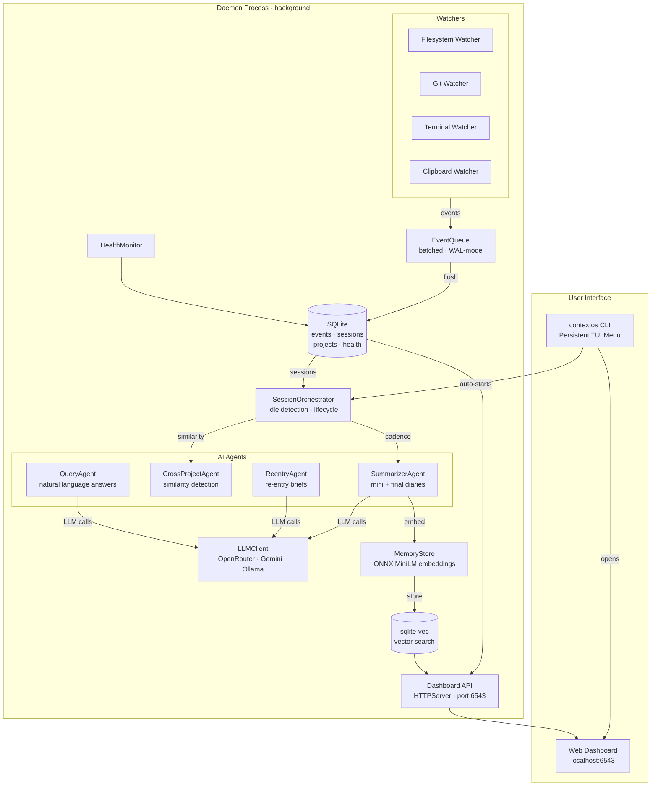

<p align="center">
  <h1 align="center">🧠 ContextOS</h1>
  <p align="center">
    <strong>A local, always-on developer memory daemon.</strong><br>
    Runs silently in the background. Records what you touch. Answers your questions in plain English.
  </p>
  <p align="center">
    <a href="https://pypi.org/project/contextos-daemon/"></a>
    <a href="https://python.org"></a>
    <a href="LICENSE"></a>
  </p>
</p>

> ContextOS does not build a productivity dashboard, does not score you, and does not phone home. The only goal is **recall**.

---

## ⚡ Why this exists

Development context is scattered across file diffs, commit messages, terminal scrollback, and half-remembered decisions. Most of it evaporates the moment you close your laptop. ContextOS turns that activity into a searchable memory layer so you can:

- **Return to a project after a break** and know exactly where you left off.
- **Reconstruct *why* a file changed**, not just *that* it changed.
- **Get an automatically written Dev Diary** after every session, with zero manual effort.
- **Ask questions about past work** instead of archaeologizing through `git log`.
- **Paste full project context** into any AI agent in one click.

---

## 🚀 Installation

Requires Python 3.11+.

```bash
pip install contextos-daemon
```

All data lives in `~/.contextos/` — the daemon **never** writes into a directory it is watching.

---

## 💻 Usage

Open any terminal in your project folder and type:

```bash
contextos
```

The first time, a brief setup wizard runs (optional API key). After that, the daemon starts silently and the menu appears. **You never need to manually start or stop the daemon** — it starts automatically every time you open ContextOS, and registers itself to run at Windows login.

### Interactive Menu

```
   ______            __             __  ____  _____
  / ____/___  ____  / /____  _  ___/ /_/ __ \/ ___/
 / /   / __ \/ __ \/ __/ _ \| |/_/ __/ / / /\__ \
/ /___/ /_/ / / / / /_/  __/>  </ /_/ /_/ /___/ /
\____/\____/_/ /_/\__/\___/_/|_|\__/\____//____/

  Project: TodoApp  ·  ● Watching  ·  http://127.0.0.1:6543

? What do you want to do?
❯   💬  Chat
    🌐  Open Dashboard
    📖  Dev Diary
    📋  Copy Context for AI
    ─────────────────────────
    Exit
```

The menu **stays open** after every action. Press `Ctrl+C` or select **Exit** to close.

### Direct commands

```bash
contextos                             # Open the interactive menu
contextos ask "why did I refactor auth?"  # Query memory directly
contextos diary                       # Read the last session Dev Diary
contextos dashboard                   # Open the local web dashboard
contextos copy                        # Copy project context for AI agents
contextos status                      # Show daemon health
```

Power-user commands (hidden from the menu):

```bash
contextos start    # Manually start / refresh the daemon
contextos stop     # Stop the daemon
contextos forget   # Remove this project from ContextOS
contextos log      # Show raw event log
contextos export   # Export full context as Markdown
contextos backfill # Re-index history into the vector store
```

---

## 📋 Copy Context for AI

Select **"Copy Context for AI"** from the menu or run `contextos copy`. ContextOS compiles your last 3 session summaries, current session activity, and recently modified files into a compact Markdown document — then copies it to your clipboard. Paste into any AI agent for instant project context.

---

## 🌐 Local Web Dashboard

```bash
contextos dashboard    # opens http://127.0.0.1:6543
```

The dashboard starts automatically with the daemon. No separate server to manage.

| Tab | What you see |
|---|---|
| **Overview** | Event counts, session stats, recent sessions |
| **Sessions** | All recorded coding sessions with status and summaries |
| **Live Events** | Raw filesystem, git, and terminal events with payloads |
| **Summaries** | AI-generated mini-summaries and final Dev Diaries |
| **Projects** | Tracked projects — with a **Stop Tracking** button to remove any project |
| **Health** | CPU, RAM, thread count — live daemon metrics |
| **Settings** | Add or change your API key (OpenRouter / Gemini / Ollama) |

Disable the dashboard with `DASHBOARD_ENABLED=false` in `~/.contextos/.env`.

---

## 🤖 LLM Configuration

ContextOS works without any API key (offline mode — raw events returned). Add a key to unlock AI-written summaries and natural language answers. You can set this from the Settings tab in the dashboard, or in `~/.contextos/.env`:

### OpenRouter (recommended)
```bash
OPENROUTER_API_KEY=sk-or-your-key-here
OPENROUTER_MODEL=openai/gpt-4o-mini   # optional override
```

### Google Gemini
```bash
GEMINI_API_KEY=AIza-your-key-here
GEMINI_MODEL=gemini-2.0-flash
```

### Ollama (fully local, no API key)
```bash
LLM_PROVIDER=ollama
OLLAMA_BASE_URL=http://localhost:11434
OLLAMA_MODEL=llama3.2
```

Provider selection when `LLM_PROVIDER=auto` (default):
1. OpenRouter → 2. Gemini → 3. Offline mode (no synthesis)

---

## 🏗️ Architecture



### Design principles

- **Local-first.** SQLite + sqlite-vec on disk. No external service required.
- **Always-on.** Daemon starts automatically. Registers as a Windows startup task on first run.
- **Resilient.** Each watcher runs independently and is supervised. A crashed watcher restarts without taking the daemon down. SQLite writes retry through lock contention.
- **Bring your own key.** LLM calls only happen for summarization and `ask` — and only if configured. Ollama enables fully air-gapped operation.
- **Zero friction.** Running `contextos` in any directory auto-trusts that project. Remove it anytime from the dashboard.

---

## 🏎️ Performance & Footprint

| Metric | Value |
|---|---|
| Idle CPU | `< 0.5%` |
| Idle RAM | `~115 MB` |
| Disk growth | `~15 KB / 1000 events` |

Embeddings use a local ONNX MiniLM model — no PyTorch dependency, loaded on demand.

---

## 🛠️ Development

```bash
git clone https://github.com/Rohith-Sheregar/ContextOS.git
cd ContextOS
pip install -e ".[dev]"
pytest tests/ -v
```

The test suite covers: event-queue batching and retry, session idle-timeout transitions, filesystem ignore-pattern matching, cross-project similarity thresholds, re-entry stale-gate logic, query-agent retrieval accuracy, LLM provider selection and graceful failure paths, and all dashboard API endpoints.

---

## ✅ What is in v1.0.0

- [x] Filesystem, Git, Terminal, and Clipboard watchers with automatic supervision and restart
- [x] Session lifecycle with idle detection and auto-close
- [x] LLM-powered mini-summaries and full Dev Diaries
- [x] Semantic memory via sqlite-vec (`contextos ask`)
- [x] Cross-project similarity detection
- [x] Re-entry briefs after returning to a project
- [x] Persistent TUI menu — stays open after every action
- [x] Auto-trust and auto-start — zero daemon management for the user
- [x] Windows startup registration — daemon runs from login
- [x] Copy Context for AI — one-click clipboard export optimised for AI agents
- [x] Local web dashboard (`localhost:6543`) with 7 tabs
- [x] Project management in dashboard — stop tracking any project with one click
- [x] API key via dashboard Settings tab
- [x] Ollama support (fully air-gapped operation)

---

## 🤝 Contributing

Issues and PRs welcome. Please run `pytest tests/ -v` before submitting — CI runs the full suite on Python 3.11 and 3.12.
